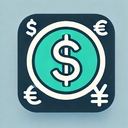

# Currency Quotation

This is a open source Chrome Extension to track currencies in your browser.

## Downloads
- [Chrome Web Store](https://chromewebstore.google.com/detail/cota%C3%A7%C3%B5es/dgoplbgoifnlfhbemelkldkifokfenpn)

## Credits
Michael Xieyang Liu - Chrome extension Boilerplate | [Github](https://github.com/lxieyang/chrome-extension-boilerplate-react)

Ranielly Ferreira - Awesome API | [Github](https://github.com/raniellyferreira/economy-api)